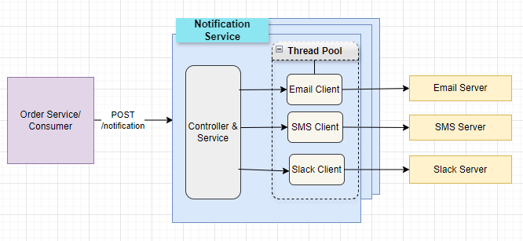

# Notification Service

# Description

* Notification service is build to handle to order notification and delivered the notification messages the various channels.
* Email, SMS and Slack channels are supported to deliver the notification.
* API service is easily extendable to support new channel to send notifications.
* 

<br/>

### Notification Service Architecture



<br/>
<br/>

### Build Notification Service
Execute following command to build the service artifacts

```
./gradlew clean build
```

<br/>

### Running Notification Service
Execute following command to run the service

```
./gradlew bootRun
```

<br/>

### Execute Tests for Notification Service
Execute following command to run test cases

```
./gradlew test
```

<br/>

### Sample Log Statements

```
2024-04-06T20:52:33.323+11:00  INFO 15684 --- [    Test worker] c.e.n.controller.NotificationController  : Received notification request for order Id : 12999922
2024-04-06T20:52:33.330+11:00  INFO 15684 --- [    Test worker] c.e.n.i.impl.EmailNotificationClient     : Email notification sent for Order ID : 12999922 and notification ID : 23e6066b-9f43-4f1b-8b26-1eba580f6f95
2024-04-06T20:52:33.331+11:00  INFO 15684 --- [    Test worker] c.e.n.i.impl.SlackNotificationClient     : Slack notification sent for Order ID : 12999922 and notification ID : 23e6066b-9f43-4f1b-8b26-1eba580f6f95
2024-04-06T20:52:33.332+11:00  INFO 15684 --- [    Test worker] c.e.n.i.impl.SmsNotificationClient       : SMS notification sent for Order ID : 12999922 and notification ID : 23e6066b-9f43-4f1b-8b26-1eba580f6f95
2024-04-06T20:52:33.333+11:00  INFO 15684 --- [    Test worker] c.e.n.controller.NotificationController  : Notification request processed for order Id : 12999922

```

<br/>

### Sample Curl Request
```
curl --location 'http://localhost:8080/api/v1/notification' \
--header 'Content-Type: application/json' \
--data-raw '{
"orderId": "12999922",
"customer": "ABC Enterprises",
"email": "abc@xyz.com",
"mobile": "999991234",
"message": "Your order has been dispatched"
}'
```

<br/>

### Author
###### Shailesh Shinde
