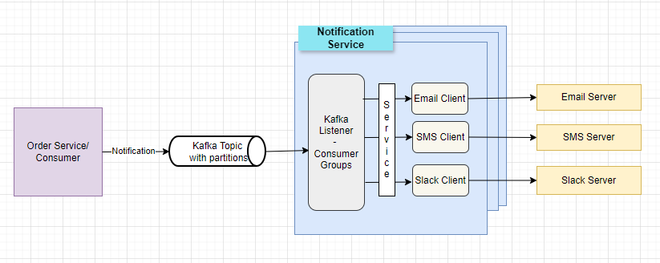

# Notification Service

# Description

* Notification service is build to handle order notifications
* Service delivers notification messages the various channels.
* Email, SMS and Slack channels are supported
* API service is easily extendable to support new channel to send notifications.

<br/>

### Notification Service Architecture
* **Scalability & High Availability** : Achieved by running multiple instances of notification service
* **Performance** : Achieved by processing notification asynchronously. 
* **Resiliency** : Not implemented in code for simplicity but using retry mechanism we can make service resilient & fault-tolerant.
* **Data Storage** : Data loss possible. Data storage requirement not consider for simplicity. Refer alternate Kafka based solution if we need to store data for short duration (few days).


<br/>
<br/>

### Build Notification Service
Execute following command to build the service artifacts

```
./gradlew clean build
```

<br/>

### Running Notification Service
Execute following command to run the service

```
./gradlew bootRun
```

<br/>

### Execute Tests for Notification Service
Execute following command to run test cases

```
./gradlew test
```

<br/>

### Sample Log Statements

```
2024-04-06T22:30:03.053+11:00  INFO 8772 --- [    Test worker] c.e.n.controller.NotificationController  : Received notification request : ServiceNotificationRequest(orderId=12999922, customer=ABC Enterprises, email=abc@xyz.com, mobile=999991234, message=Your order has been dispatched)
2024-04-06T22:30:03.064+11:00  INFO 8772 --- [    Test worker] c.e.n.controller.NotificationController  : Sent Notification response : ServiceNotificationResponse(notificationId=a4fd910e-e939-4eb7-802e-145821b9e465, orderId=12999922)
2024-04-06T22:30:03.069+11:00  INFO 8772 --- [         task-1] c.e.n.i.impl.EmailNotificationClient     : Email notification sent for Order ID : 12999922 and notification ID : a4fd910e-e939-4eb7-802e-145821b9e465
2024-04-06T22:30:03.070+11:00  INFO 8772 --- [         task-1] c.e.n.i.impl.SlackNotificationClient     : Slack notification sent for Order ID : 12999922 and notification ID : a4fd910e-e939-4eb7-802e-145821b9e465
2024-04-06T22:30:03.071+11:00  INFO 8772 --- [         task-1] c.e.n.i.impl.SmsNotificationClient       : SMS notification sent for Order ID : 12999922 and notification ID : a4fd910e-e939-4eb7-802e-145821b9e465

```

<br/>

### Sample Curl Request
```
curl --location 'http://localhost:8080/api/v1/notification' \
--header 'Content-Type: application/json' \
--data-raw '{
"orderId": "12999922",
"customer": "ABC Enterprises",
"email": "abc@xyz.com",
"mobile": "999991234",
"message": "Your order has been dispatched"
}'
```

<br/>

### Leftover
* Exception handling and partial failures are not implemented for simplicity.
* Validation, data sanitization and data masking not implemented.
* Extensive test cases are not written as no business logic in code. Focus was more on design side.
* Process multiple notifications in single request is not implemented for simplicity.
* Configuration from YAML file is not used. Configuration needs to be externalise with spring-cloud-config
* Spring profiles are not used. In real world application, we will have different downstream URLs for each environment like test, uat, prod.

<br/>


### Notification Service Alternate Architecture - Kafka Based

* **Data Storage** : By default data persisted in kafka for 7 days.



<br/>
<br/>

### Author
###### Shailesh Shinde
